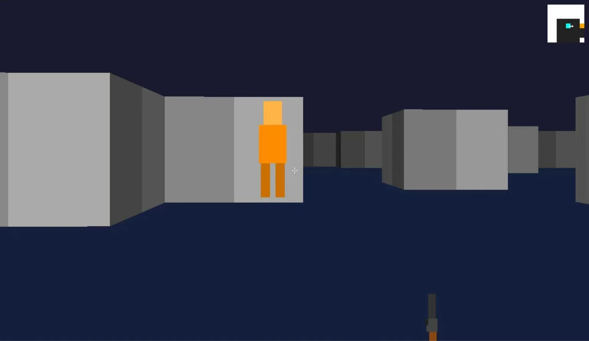

# FPS Raycasting Engine

A single-file C++20 FPS raycasting engine built with SDL3, featuring procedural maze generation, enemy AI, weapon systems, and synthesized 8-bit audio.

## Why This Project?

This project demonstrates low-level systems programming skills (memory management, real-time rendering, pathfinding AI) using modern C++20 — foundational for game engine and AI infrastructure development.

## Features

- **DDA Raycasting** with texture mapping, fog, and lighting
- **DFS Maze Generation** (41x41 procedural dungeons)
- **Player Mechanics**: WASD movement, mouse look, jump, crouch, wall-slide
- **Enemy AI**: 6 enemies with BFS pathfinding (varied speed/HP/damage)
- **Weapon System**: Pistol, shotgun, rifle with ammo, reload, and realistic recoil
- **Audio Synthesis**: Procedural 8-bit sound effects (shoot, hit, damage, reload, pickup) — zero external audio files
- **HUD**: Minimap, health/ammo display
- **Game States**: Pause, game over, reset

## Screenshots



## Build

### Requirements
- Windows 10/11
- MinGW-w64 (GCC 13+) or MSVC
- SDL3 development library

### Compile
```bash
g++ -std=c++20 fps.cpp -o fps.exe -I/path/to/SDL3/include -L/path/to/SDL3/lib -lSDL3
```

Ensure `SDL3.dll` is in the same directory as the executable.


## Controls

| Key        | Action        |
| :--------- | :------------ |
| W/A/S/D    | Move          |
| Mouse      | Look around   |
| Space      | Jump          |
| Ctrl       | Crouch        |
| Left Click | Shoot         |
| 1/2/3      | Switch weapon |
| R          | Reload        |
| Esc        | Pause         |


## Tech Stack

- C++20 (structured bindings, CTAD, lambda recursion, ranges)
- SDL3 (graphics & input)
- Custom procedural audio synthesis


## License

MIT